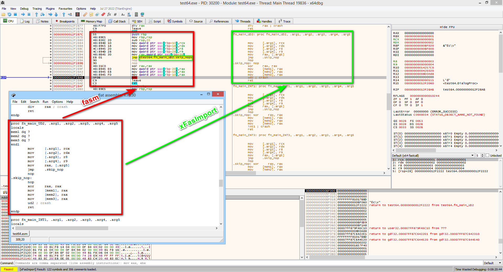

# xFasImport
Plugin for importing debug information from fasm (flat assembler) into x64dbg debugger (from .fas file)

## Functionality of xFasImport
- Support for fasm debug data for executable files in PE/PE+ format (win32/win64);
- Support for loading debug data for a DLL (selecting a module whose addresses require loading debug data);
- Loading label and function names;
- Loading the lines of the source asm-file into the comments (for a more understandable analysis of the machine code generated by macros, the names of local variables in proc-functions, author's comments);
- Unicode support (national characters other than ASCII) in file paths;
- Full support for any national 8-bit encodings in the sources (everything is correctly converted - the source encoding is specified in the plugin settings - and imported into x64dbg as UTF-8).

## Build instructions
Edit path (set fasm=E:\ASM\FASM) in _build*.cmd files and use _build*.cmd files for build.

## Download
Details, instructions, release download - https://f2065.ru/en/soft/xfasimport_en/
